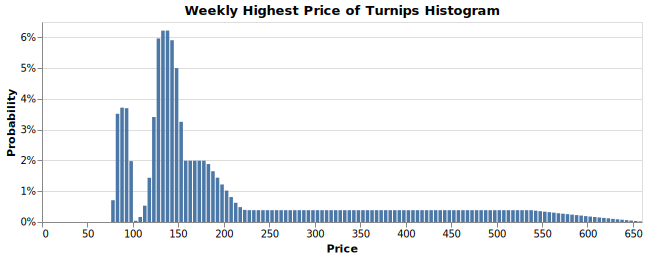

# Turnip Price

[中文版](docs/README_zh-CN.md)

A Rust (and WebAssembly) implementation of the calculator turnip price of Animal Crossing: New Horizon. This project can't be done without [@_Ninji](https://twitter.com/_Ninji)'s [C++ code](https://gist.github.com/Treeki/85be14d297c80c8b3c0a76375743325b) and his disassembly work. You can try the [demo](https://turnip-price.now.sh) online.

## 🚀 Getting Started

You can install this package via npm or Yarn.

```bash
npm i turnip-price
# or
yarn add turnip-price
```

Also, make sure that the target environment has access to WebAssembly. Then you can write a calculation function like this.

```js
import * as wasm from "turnip-price";
import { memory } from 'turnip-price/turnip_price_bg';

function predict(whatPattern, seed) {
  const prediction = wasm.predict(whatPattern, seed);
  const prices = new Int32Array(memory.buffer, prediction.prices(), 14);
  return prices; // Length = 14
}
```

Explanation of the `prices` array:

* The first element in the `prices` array indicate the buying price on Sunday;
* The second element is meaningless;
* The 2nd, 4th, 6th, 8th, 10th, 12th elements indicate the morning price from Tuesday to Saturday respectively;
* The 3rd, 5th, 7th, 9th, 11th, 13th elements indicate the afternoon price from Tuesday to Saturday respectively.

## 🤔 FAQ

### 📈 Can I Predict the Price on My Island by This?

No, yet. *Because you don't have the random seed, which is not exposed to regular players.* By the way, if you have the seed, *the calculator won't work the first time you buy the turnips*, according to [@_Ninji's reply](https://twitter.com/_Ninji/status/1245097287136706561?s=20).

### 🕸️🦀️ Why do you use WebAssembly?

Because the code involves the practice of reinterpreting unsigned 32-bit integer as 32-bit IEEE 754 floating number. Though I can

## 🔍 Discovery

### 📚 Can I Enumerate All Combinations?

There are total `4 × 2 ^ 32 = 17,179,869,184` combinations.
On my machine, it tooks 4 minutes to enumerate all combinations (in 4 threads).

However, it's cost to save all combinations to your disk.
For each combination, the algorithm will product 13 prices.
Each price is a positive integer from 0 to around 660, which can be represented by an unsigned 10-bit integer.
Therefore, the uncompressed data size is 2,233,382,993,920 bits, i.e. 260 GBs.

### 💰 How Much Is The Highest Price?

I tried all combinations of patterns (0, 1, 2, 3) and seeds (from 0 to `UINT32_MAX`). Here is the results.

* In pattern 0 (i.e. `what_pattern` is set to 0), the highest price is 660 when seed = 326.
* In pattern 1 (i.e. `what_pattern` is set to 1), the highest price is 660 when seed = 326.
* In pattern 2 (i.e. `what_pattern` is set to 2), the highest price is 660 when seed = 326.
* In pattern 3 (i.e. `what_pattern` is set to 3), the highest price is 660 when seed = 9772.

In conclusion, **the highest price of turnips is 660**.

### 📈 Weekly Highest Price Distribution

You may want to acknowledge the distribtion. I also did this.


